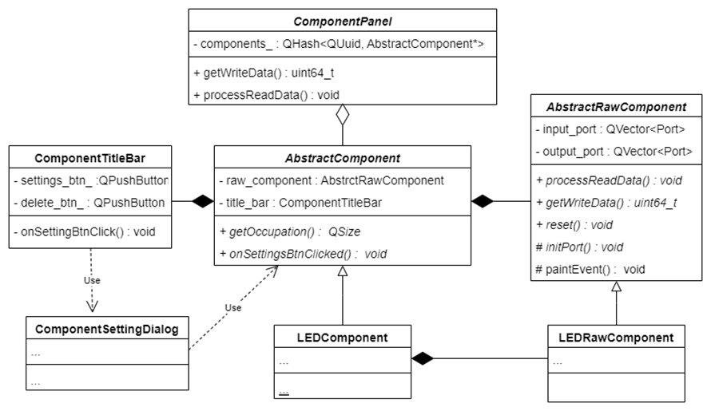
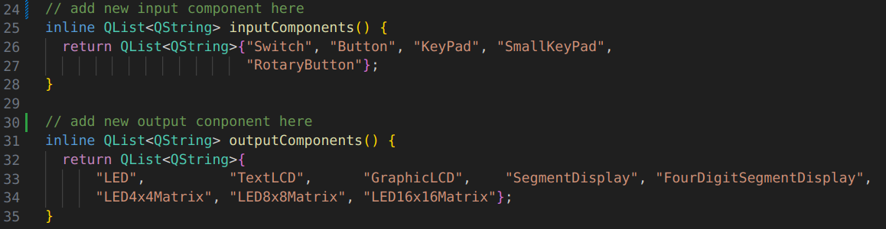
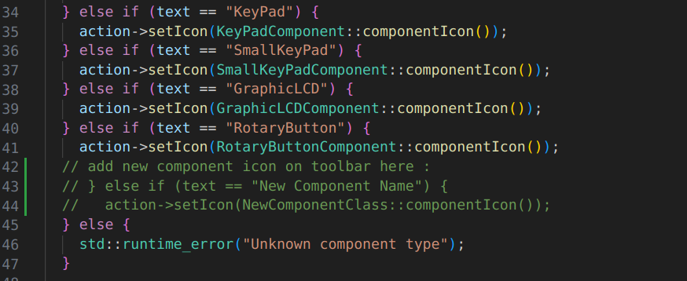
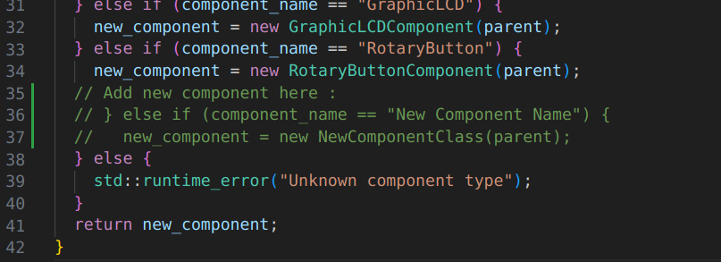
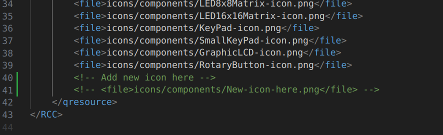

# Add New Component for Rabbit

## Content

- [Add New Component for Rabbit](#add-new-component-for-rabbit)
  - [Content](#content)
  - [1. Introduction](#1-introduction)
  - [2. Source code of component part](#2-source-code-of-component-part)
  - [3. Write the code of the new component](#3-write-the-code-of-the-new-component)
    - [3.1. Inherit from `AbstractRawComponent`](#31-inherit-from-abstractrawcomponent)
    - [3.2. Inherit from `AbstractComponent`](#32-inherit-from-abstractcomponent)
    - [3.3. Component Settings](#33-component-settings)
  - [4. Show in the tool bar](#4-show-in-the-tool-bar)
    - [4.1. Register](#41-register)
    - [4.2. Set the icon](#42-set-the-icon)
  - [5. Build and Run](#5-build-and-run)

## 1. Introduction

**Rabbit** is a virtual components platform for FDP3P7 FPGA boad. It can receive and send data from/to the FPGA board via USB and show the data through the GUI. 

Refer to the github [repository](https://github.com/0xtaruhi/Rabbit) for more information.

You can add new components to Rabbit to extend its functions. This document will show you how to add new components to Rabbit. Before that, you need to learn how to use [Qt6](https://doc.qt.io/qt-6/) and C++.

## 2. Source code of component part

<p align="center">
        
</p>

This is the basic structure of the code of component part.

Every component tile in the component panel is a class inherited from **`AbstractComponent`**, which is defined in `rabbit_App/include/Components/AbstractComponent.h`. This abstract class has two main members :
* `ComponentTitleBar` : the title bar of the component, display the name of the component, settings button and close button. 
* **`AbstractRawComponent`** : the raw component, which is the main part of the component. It will display the component int the tile, prcess read data, and emit write data.

To find more details about the code of component part, you can refer to the following files :
[RabbitDevDoc.md](./RabbitDevDoc.md)


## 3. Write the code of the new component

You can refer to the code of the existing components to write the code of the new component. Normally, you need to create two files :
* `NewComponent.h` : the header file of the new component, in `rabbit_App/include/Components`
* `NewComponent.cpp` : the source file of the new component, in `rabbit_App/src/Components`

The most important thing is to inherit from the class `AbstractRawComponent` and `AbstractComponent`, such as `LEDRawComponent` and `LEDComponent`.

### 3.1. Inherit from `AbstractRawComponent`

You must override the following virtual functions :
| Function                                             | Access    | Description                           |
| :--------------------------------------------------- | :-------- | :------------------------------------ |
| `void initPorts()`                                   | protected | initialize the ports of the component |
| `void paintEvent`                                    | protected | paint the component                   |
| `void reset()`                                       | public    | reset the component                   |
| `void processReadData(QQueue<uint64_t> &read_queue)` | public    | process the read data                 |
| `uint64_t getWriteData() const`                      | public    | get the write data to send            |

* **`void initPorts()`** : 

    Initialize the ports of the component. You should add the ports of the component in this function. Every raw component has `input_ports_` and `output_ports_` as the member variables. Use `appendPort` function to add the ports.

    **Note** : order of the ports is important. The order of the ports in the `input_ports_` and `output_ports_` will influence the `processReadData/getWriteData` function


* **`void paintEvent`** : 
  
    paint the component. Use `QPainter` to draw. Refer to [Qt Documentation](https://doc.qt.io/qt-6/qpainter.html) for more details.

* **`void reset()`** :

    Reset the component. This function will be called when the Run/Stop button in the tool bar are clicked. 

* **`void processReadData(QQueue<uint64_t> &read_queue)`** :

    Process the read data. This function will be called by `ValueUpdateController` 60 times per second. The read data is stored in the queue `read_queue`. You can use `read_queue.dequeue()` to get the data. 

    **Note** : refer to [`rabbit_App/src/Ports/PinInfo.cpp`](../rabbit_App/src/Ports/PinInfo.cpp) for the details of the data format. Remember to minus 1 for the output port index, because 0 is used by the clock.

* **`uint64_t getWriteData() const`** :

    Get the write data to send. 

### 3.2. Inherit from `AbstractComponent`

In most cases, you don't need to write any declaration in the header file. You can just use the macro :
```cpp
COMPONENT_CLASS_DECLARATION(NewComponent)
```
and it will generate the declaration of the class `NewComponent` for you.

Also, in the source file, you can use the macro :
```cpp
COMPONENT_CLASS_DEFINITION(New, 2, 2)
```
to generate the definition of the class `NewComponent` for you. The first parameter is the pure name **(without `Component` suffix)** of the class, the second parameter is the **width** of the component, and the third parameter is the **height** of the component.

Of course, you can also write the declaration and definition of the class `NewComponent` by yourself, especially when you want to add some new members or functions.

**Additionally**, you must implement this function in NewComponent class by yourself : **`void onSettingsBtnClicked()`**. This function will be called when the settings button is clicked. Refer to  for more details.


### 3.3. Component Settings

When the settings button is clicked, the function `onSettingsBtnClicked` will be called. You can implement this function to show the settings dialog of the component.

Normally, a dialog will be created in the function `onSettingsBtnClicked`. If there is not special requirement, you can use the class `ComponentSettingsDialog` like this:
```cpp
void NewComponent::onSettingsBtnClicked() {
  auto dialog = new ComponentSettingsDialog(this, this);
  dialog->exec();
  delete dialog;
}
```

But if you want to add some other settings, you need to create a new class inherited from **`ComponentSettingsDialog`** or other dialog classes in `rabbit_App/include/ComponentsSettingsDialog.h`, which are virtually inherited from `ComponentSettingsDialog` :
* `ComponentSettingsDialog` : the base class of all the dialog classes. You can also use it directly.
* **`ActiveModeSettingsDialog`** : the dialog class for the component with active mode.
* **`VisionPersistenceSettingsDialog`** : the dialog class for the component with vision persistence.
* **`ColorSettingsDialog`** : the dialog class for the component with color settings.

For example, if you want to add the settings for the component with *active mode* and *vision persistence*, you can create a new class like this :
```cpp
class LEDMatrixSettingsDialog : public ActiveModeSettingsDialog,
                                   public VisionPersistenceSettingsDialog {
  Q_OBJECT

public:
  LEDMatrixSettingsDialog(AbstractComponent *component,
                             QWidget *parent = nullptr);
  virtual ~LEDMatrixSettingsDialog();

protected:
  void acceptDerivedClassSettings() override;

}; // class LEDMatrixSettingsDialog
```
The override function `acceptDerivedClassSettings` is used to accept the settings when the dialog is accepted.

If you want to add **new** settings, refer to the class `ActiveModeSettingsDialog` or `VisionPersistenceSettingsDialog`  and write a new setting dialog class.


## 4. Show in the tool bar

To show the new component in the tool bar, you need to follow the following steps :

### 4.1. Register

To register the new component, you need to add some code in the following files : 
* `Component.h` : 
    <p align="center">
        
    </p>
* `ComponentAction.cpp`
    <p align="center">
        
    </p>
* `ComponentsFatory.cpp`
    
    <p align="center">
        
    </p>

### 4.2. Set the icon

* add the icon of the new component in the folder `rabbit_App/res/icons/components`
* add the icon in the file `rabbit_App/res/res.qrc`
    <p align="center">
        
    </p>


## 5. Build and Run