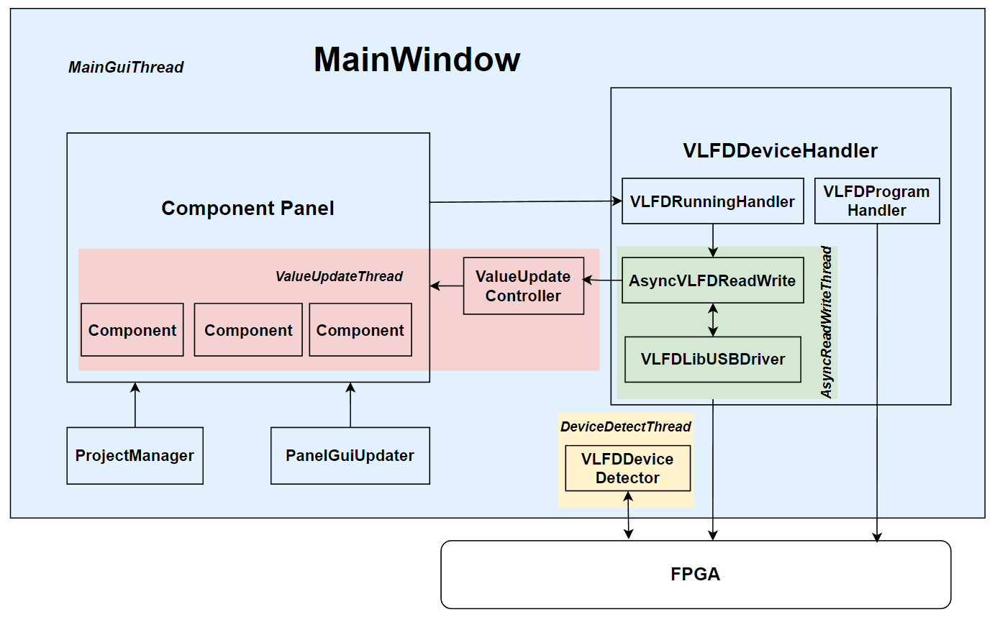

# Rabbit Development Documentation

## Content

- [Rabbit Development Documentation](#rabbit-development-documentation)
  - [Content](#content)
  - [Introduction](#introduction)
  - [Architecture](#architecture)
  - [Development](#development)

## Introduction

**Rabbit** is a virtual components platform for FDP3P7 FPGA boad. It can receive and send data from/to the FPGA board via USB and show the data through the GUI. 

Refer to the github [repository](https://github.com/0xtaruhi/Rabbit) for more information.

## Architecture

The architecture of Rabbit is shown below.

    

## Development

Refer to the [Development Handbook](https://github.com/0xtaruhi/Rabbit/blob/main/doc/RabbitDevHandbook.chm) for more information.

