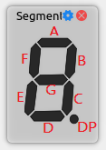

# Rabbit Help Documentation

## Content

- [Rabbit Help Documentation](#rabbit-help-documentation)
  - [Content](#content)
  - [1. Introduction](#1-introduction)
  - [2. Main Window](#2-main-window)
  - [3. New Project \& Project Settings](#3-new-project--project-settings)
  - [4. Program FPGA \& Run](#4-program-fpga--run)
  - [5. WaveForm](#5-waveform)
  - [6. Component Library](#6-component-library)
    - [6.1 Introduction](#61-introduction)
    - [6.2 Component Settings](#62-component-settings)
    - [6.3 Input](#63-input)
      - [6.3.1 Switch](#631-switch)
      - [6.3.2 Button](#632-button)
      - [6.3.3 KeyPad](#633-keypad)
      - [6.3.4 Small Keypad](#634-small-keypad)
      - [6.3.5 Rotary Button](#635-rotary-button)
      - [6.3.6 PS2Keyboard](#636-ps2keyboard)
    - [6.4 Output](#64-output)
      - [6.4.1 LED](#641-led)
      - [6.4.2 TextLCD](#642-textlcd)
      - [6.4.3 GraphicLCD](#643-graphiclcd)
      - [6.4.4 SegmentDisplay](#644-segmentdisplay)
      - [6.4.5 FourDigitSegmentDisplay](#645-fourdigitsegmentdisplay)
      - [6.4.6 LEDMatrix](#646-ledmatrix)

## 1. Introduction

**Rabbit** is a virtual components platform for FDP3P7 FPGA boad. It can receive and send data from/to the FPGA board via USB and show the data through the GUI. 

Refer to the github [repository](https://github.com/0xtaruhi/Rabbit) for more information.

## 2. Main Window

The mainwindow is composed of a tool bar, a components panel, and a prompt bar.

* There are two pages in the tool bar: Project page and Components page
  * In project page, you can new/open/save project; download bitstream and run .
  * In component page, you can add some components to your project. 
*  Component panel is the place to show the components.
* Prompt bar indicates whether the FDP3P7 board is connected.

    

## 3. New Project & Project Settings

To create a new project, click the **New Project** button on the tool bar. Then you should set the project name and the project path. The constraints file and bitstream file are optional, you can set them later. After that, a project file with the suffix **.rbtprj** will be created in the project path.

    

To set the project settings, click the **Settings** button on the toolbar, where you can set the  constraints file and bitstream file.

    

## 4. Program FPGA & Run

Before programming the FPGA, make sure that the FPGA board is connected to the computer. The prompt bar at the bottom of the main window will show the connection status. If the FPGA board is connected, the prompt bar will show `USB Connected` , otherwise it will show `USB Disconnected`.

When the FPGA board is connected and the bitstream file is set, you can click the **Download** button on the toolbar to program the FPGA. After that, click the **Run** button to run or **Stop** button to stop.

To change the frequency of the clock, enter the frequency in the spin box on the toolbar.

## 5. WaveForm

Rabbit can show the waveform of the signals. To show the waveform, click the **WaveForm** button on the toolbar. Then the waveform window will be shown in **gtkwave**.

If you prefer not to generate waveform files during a run, open **Settings** from the toolbar and uncheck **Generate Waveform**. The setting can be changed at any time.

    

When running is stopped with waveform generation enabled, three files will be generated in the project path: **RabbitWaveForm.vcd**, **RabbitReadData.txt**, and **RabbitWriteData.txt**. The first file is the waveform file, and the other two files are the data files of the read and write signals. You can open the waveform file in gtkwave to show the waveform, and open the data files in a text editor to show the data.

**Note**: The waveform file will be overwritten every time you run the program. If you want to save the waveform, you should save it manually.

## 6. Component Library

### 6.1 Introduction

To communicate with the FPGA board, you need to add components to the project. You can add components by clicking the component buttons on the component page, then it will be shown on the component panel in a tile.

    

Change the position by dragging the tile, and delete the component by clicking the delete button on the component title bar. You can also click the setting button of a component to change the component settings. 

### 6.2 Component Settings

All the components have the settings of **Name**  and **Port**. Some components have more settings like **active mode** and **color**.
* **Name**: The name of the component, which will be shown on the component tile.
* **Port**: The ports of the component. You must set the constraints file before setting the ports, and after that, you can select the corresponding port in the combo box.
* **Active Mode**: The active mode of the component. Some components have high-active mode and low-active mode, and some components have only one mode.
* **Color**: The color of the component.
* **Vision Persistance**: The vision persistance of the component is the time that the LED or other components will remain on after the signal is removed. The unit is millisecond. The maximum value is 1000ms, or set it to 0 to disable the vision persistance.

Here is the list of components. *Most of the components are introduced in high-active mode unless otherwise specified*. 

### 6.3 Input

#### 6.3.1 Switch

    

**Bit Width** : 1

**Port List** : 

| Port Name |  Description  |
| :-------: | :-----------: |
|   `SW`    | switch output |

**Description**  : 

Output 1 when the switch is on, otherwise output 0.

#### 6.3.2 Button

    

**Bit Width** : 1

**Port List** :
| Port Name |  Description  |
| :-------: | :-----------: |
|   `BTN`   | button output |

**Description**  : 

Output 1 when the button is pressed, otherwise output 0.

#### 6.3.3 KeyPad

    

**Bit Width** : 8

**Port List** :
| Port Name  |  Description  |
| :--------: | :-----------: |
| `ROW[0:3]` |  row output   |
| `COL[0:3]` | column output |

**Description**  : 

A Keypad with 4 rows and 4 columns, containing `0-9` and `A-F`. When a key is pressed, the corresponding row and column will output 1, otherwise output 0.

For example, if the key `E` is pressed, the output will be `ROW[3] = 1`, `COL[2] = 1`, and the other ports will be 0.

#### 6.3.4 Small Keypad

    

**Bit Width** : 7
**Port List** :

| Port Name  |  Description  |
| :--------: | :-----------: |
| `ROW[0:3]` |  row output   |
| `COL[0:2]` | column output |

**Description**  : 

A Keypad with 4 rows and 3 columns, containing `0-9` and `*` `#`. When a key is pressed, the corresponding row and column will output 1, otherwise output 0.

#### 6.3.5 Rotary Button

    

**Bit Width** : 11

**Port List** :
|  Port Name  |     Description      |
| :---------: | :------------------: |
| `RPB[0:10]` | rotary button output |

**Description**  :

A rotary button with 12 positions. If position is `12`, the all the output are `1`. Otherwise, the corresponding bit will be 0. Here is the truth table of the output:

| position |  RPB[0:10]  |
| :------: | :---------: |
|    1     | 01111111111 |
|    2     | 10111111111 |
|    3     | 11011111111 |
|    4     | 11101111111 |
|    5     | 11110111111 |
|    6     | 11111011111 |
|    7     | 11111101111 |
|    8     | 11111110111 |
|    9     | 11111111011 |
|    10    | 11111111101 |
|    11    | 11111111110 |
|    12    | 11111111111 |

#### 6.3.6 PS2Keyboard

    

**Bit Width** : 2

**Port List** :

| Port Name  |       Description       |
| :--------: | :---------------------: |
|   `PCLK`   |  keyboard clock output  |
|   `PDATA`  |  keyboard data output   |

**Description**  :

Developed by Jianrong Zhang from FD 21ME.

A keyboard using PS/2 protocol. The keyboard is free to send data to the host when both Data and Clock lines are kept high. The keyboard will take the Data line low (Start bit) and then start generating the clock pulses on the Clock line. Each bit is sent in series with the following order:

Start bit => 0...7 data bits => Odd parity bit => Stop bit.

Each bit is read on the falling edge of the clock so keep it synchronized correctly.

The PS/2 protocol need a high working frequency (recommendedly 10000Hz) to get a good effect.And before using, you need to click the item which is already placed to get a input focus and it will turn green when focused. For the driver and decooder of hardware side, you can refer to the [demo](https://github.com/Starryskyz/PS2KeyboardHardwareDemo)

### 6.4 Output

#### 6.4.1 LED

    

**Bit Width** : 1

**Port List** :
| Port Name | Description |
| :-------: | :---------: |
|   `LED`   |  LED input  |

**Description**  : 

If the input is 1, the LED will be on, otherwise it will be off.

#### 6.4.2 TextLCD

    

**Bit Width** : 9

**Port List** : 
| Port Name |  Description  |
| :-------: | :-----------: |
|   `EN`    | enable signal |
| `DB[0:7]` |   data bus    |

**Description**  : 

When `EN` is low, the character represented by `DB[0:7]` will be shown on the LCD. After that, current cursor position will be increased by 1 automatically. If the cursor position is greater than 15, the cursor will be reset to 0. 

If `EN` is high, the LCD will be cleared.

#### 6.4.3 GraphicLCD

    

**Bit Width** : 14

**Port List** :
| Port Name |           Description           |
| :-------: | :-----------------------------: |
| `DB[0:7]` |            data bus             |
|   `DI`    |    data/command mode select     |
|   `RW`    | read/write select, useless here |
|   `EN`    |    enable signal, low active    |
|   `CS1`   |        left side of LCD         |
|   `CS2`   |        right side of LCD        |
|   `RST`   |   reset the screen and memory   |

**Description**  : 

GrapicLCD can display 128x64 pixels. It is divided into 2 side, the left and right one, and each side's size is 64x64 pixels. Also, each side is divided into 8 8x64 pages.
GraphicLCD also has a memory with 64 bytes, and each byte represents 8 pixels of a page. This means you can only display one page at a time.

Each page has **X** and **Y** address:

* **X** address indicates the page's position in one side, from 0 to 7. 
* **Y** address  indicates where to start display. It varies from 0 to 63, but in most cases, you can set it to 0.

    

GraphicLCD has two working mode: **Command Mode** and **Data Mode**. The mode can be changed by setting the **`DI`** port. 

* When `DI` is low, the mode is Command Mode, and `DB[0:7]` will be treated as command. 
* Otherwise, the mode will be set as `Data Mode`, and `DB[0:7]` will be treated as data to be written to the memory.

* **Command Mode**
  
    * **Screen Display**
      
        |  DB7  |  DB6  |  DB5  |  DB4  |  DB3  |  DB2  |  DB1  |  DB0  |
        | :---: | :---: | :---: | :---: | :---: | :---: | :---: | :---: |
        |   0   |   0   |   1   |   1   |   1   |   1   |   1   |   X   |
        * `DB0` = 0: Turn on the screen, show the data from memory.
            X address indicates the page's position, and Y address indicates which byte of the page will present the least important side of the memory.
        * `DB0` = 1: Turn off the screen, but the data in the memory will not be cleared.
    
    * **Set Y Address**
    
        |  DB7  |  DB6  |  DB5  |  DB4  |  DB3  |  DB2  |  DB1  |  DB0  |
        | :---: | :---: | :---: | :---: | :---: | :---: | :---: | :---: |
        |   1   |   1   |   X   |   X   |   X   |   X   |   X   |   X   |
        
        Set the Y address of the screen.
    
    * **Set X Address**
    
        |  DB7  |  DB6  |  DB5  |  DB4  |  DB3  |  DB2  |  DB1  |  DB0  |
        | :---: | :---: | :---: | :---: | :---: | :---: | :---: | :---: |
        |   1   |   0   |   1   |   1   |   1   |   X   |   X   |   X   |
    
        Set the X address of the screen, namely the page address. Remember to provide cs1/2 signal to select the left/right side of the screen at this time.
    
    * **Set Memory Address**
    
        |  DB7  |  DB6  |  DB5  |  DB4  |  DB3  |  DB2  |  DB1  |  DB0  |
        | :---: | :---: | :---: | :---: | :---: | :---: | :---: | :---: |
        |   0   |   1   |   X   |   X   |   X   |   X   |   X   |   X   |
    
        * Set the memory address, which indicate which byte of the memory will be set in Data Mode. 
        * Default value is 0.
        * **The address will be increased by 1 automatically after written**. If the address is greater than 63, the address will be reset to 0.  It means that you only need to set it to 0 for one time in most cases.
    
* **Data Mode**
  
    In data mode, `DB[0:7]`  will be written to the memory address.

This is a typical **example** of using GraphicLCD:

* In the first falling edge, set the x address.
* In the second falling edge, set the y address to 0
* In the third falling edge, set the memory address to 0.
* In the next 64 falling edges, write the data to the memory address per falling edge.
* In the 68th falling edge, show the data from memory.
* repeat the above steps for 8 times to show all the pages.
* change cs1/2 signal, and repeat the above steps to show the other side of the screen.
* repeat the above steps.

#### 6.4.4 SegmentDisplay

    

**Bit Width** : 8

**Port List** :

| Port Name |      Description      |
| :-------: | :-------------------: |
|   `A-G`   | segment display input |
|   `DP`    |  decimal point input  |

    

**Description**  :

SegmentDisplay can display 1 digits and a decimal point. It is **low active** on default. When the corresponding input is low, the segment will be on.

#### 6.4.5 FourDigitSegmentDisplay

    

**Bit Width** : 12

**Port List** :

| Port Name  |                       Description                       |
| :--------: | :-----------------------------------------------------: |
|  `A`-`G`   |                  segment display input                  |
|    `DP`    |                   decimal point input                   |
| `SEL[0:3]` | select the digit to display, **the left one is SEL[0]** |

**Description**  :

FourDigitSegmentDisplay can display 4 digits. It is also **low active** on default. Set `SEL[0:3]` to select the digit to display. If more than one digit is selected, the left one will be displayed.

Use the **Vision Persistance** setting to set the vision persistance of the SegmentDisplay. The vision persistance is the time that the SegmentDisplay will remain on after the signal is removed. The unit is millisecond. The maximum value is 1000ms, and set it to 0 to disable the vision persistance. 100~300ms is usually a good value for 1000Hz, but you need to try several time to find out the best one.

#### 6.4.6 LEDMatrix

    
    
    

**Bit Width** : 8/16/32

**Port List** :

| Port Name  |       Description       |
| :--------: | :---------------------: |
| `ROW[0:x]` |  LED matrix row input   |
| `COL[0:x]` | LED matrix column input |

**Description**  :

LEDMatrix can display 4x4/8x8/16x16 LEDs. Use ROW[0:x] and COL[0:x] to set the LED matrix. If the corresponding input is 1, the LED will be on, otherwise it will be off.

**Vision Persistance** setting is also available for LEDMatrix.

